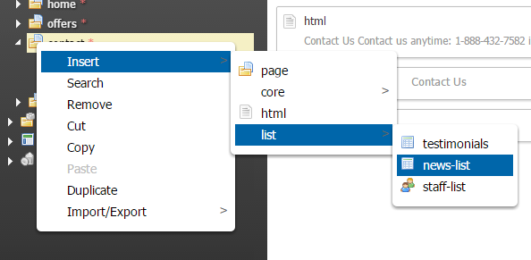

Getting started
===============

Please refer to our [WebPal Developer Guide](https://www.gitbook.com/book/palomino/webpaldev/details) for more information on how to use WebPal extensions

- Writing and extension
- GitHub integration

NOTE: 'extensions-essentials' is required for all WebPal extensions

News-list
=========

Plugin for WebPal-powered applications

A news-list is a list of news items where all data is kept in an editable table with layout options

Simply add this plugin to your WebPal extensions

Insert a news-list into a page you are creating



### Optional:

Inset following XSL in your template for a news widget populating few of most recent news items:

```   
 <xsl:call-template name="newslistWidget">  
 <xsl:with-param name="node-name" select="'newslistname'" />  
 <xsl:with-param name="enable-view-all-link" select="true()" />  
 <xsl:with-param name="view-all-link-text" select="'Read more'" />  
 <xsl:with-param name="enable-individual-page" select="true()" />  
 <xsl:with-param name="col-class" select="'col-md-4 col-lg-3'"/>  
 <xsl:with-param name="max-items" select="number(8)"/>  
 </xsl:call-template>  
 ```

You have the ability to customize the values under 'select'. Most importantly, `<xsl:with-param name="node-name" select="'newslistname'" />`, "newslistname" should be changed to name of the news-list you wish to generate this widget for.

Requires Bootstrap 3.3 and FontAwesome 4.5 frameworks